## 网络基础
* 参考内容
    + `https://mp.weixin.qq.com/s/UiXTE4F5C3EHluPn04jnLw`

### 前言
OSI和TCP/IP是很基础但又非常重要的知识，很多知识点都是以它们为基础去串联的，作为底层，掌握得越透彻，理解上层时会越顺畅。

**今天这篇网络基础科普，就是根据OSI层级去逐一展开的**
* 

### 计算机网络基础

#### 计算机网络的分类
* 按照网络的作用范围：广域网（WAN）、城域网（MAN）、局域网（LAN）；
* 按照网络使用者：公用网络、专用网络。

#### 计算机网络的层次结构
* 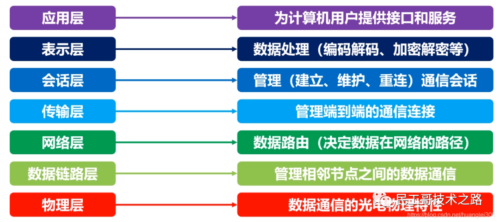

#### TCP/IP四层模型与OSI体系结构对比
* 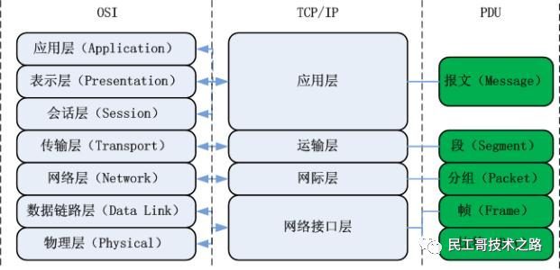

#### 层次结构设计的基本原则
* 各层之间是相互独立的；
* 每一层需要有足够的灵活性；
* 各层之间完全解耦。
* 

#### 计算机网络的性能指标
* 速率：bps=bit/s；
* 时延：发送时延、传播时延、排队时延、处理时延；
* 往返时间RTT：数据报文在端到端通信中的来回一次的时间。

### 物理层
#### 物理层的作用
连接不同的物理设备，传输比特流。该层为上层协议提供了一个传输数据的可靠的物理媒体。简单的说，物理层确保原始的数据可在各种物理媒体上传输。

#### 物理层设备
* 中继器【Repeater，也叫放大器】：同一局域网的再生信号；两端口的网段必须同一协议；5-4-3规程：10BASE-5以太网中，最多串联4个中继器，5段中只能有3个连接主机；
* 集线器：同一局域网的再生、放大信号（多端口的中继器）；半双工，不能隔离冲突域也不能隔离广播域。

#### 信道的基本概念
信道是往一个方向传输信息的媒体，一条通信电路包含一个发送信道和一个接受信道。
* 单工通信信道：只能一个方向通信，没有反方向反馈的信道；
* 半双工通信信道：双方都可以发送和接受信息，但不能同时发送也不能同时接收；
* 全双工通信信道：双方都可以同时发送和接收。

### 数据链路层
数据链路层在物理层提供的服务的基础上向网络层提供服务，其最基本的服务是将源自网络层来的数据可靠地传输到相邻节点的目标机网络层。数据链路层在不可靠的物理介质上提供可靠的传输。

该层的作用包括：物理地址寻址、数据的成帧、流量控制、数据的检错、重发等。

#### 有关数据链路层的重要知识点
* 数据链路层为网络层提供可靠的数据传输；
* 基本数据单位为帧；
* 主要的协议：以太网协议；
* 两个重要设备名称：网桥和交换机。

封装成帧：“帧”是数据链路层数据的基本单位：
* 

透明传输：“透明”是指即使控制字符在帧数据中，但是要当做不存在去处理。即在控制字符前加上转义字符ESC。
* 

#### 数据链路层的差错监测
差错检测：奇偶校验码、循环冗余校验码CRC
* 奇偶校验码–局限性：当出错两位时，检测不到错误。
* 循环冗余检验码：根据传输或保存的数据而产生固定位数校验码。

#### 最大传输单元MTU
最大传输单元MTU(Maximum Transmission Unit)，数据链路层的数据帧不是无限大的，数据帧长度受MTU限制。

路径MTU：由链路中MTU的最小值决定。
* 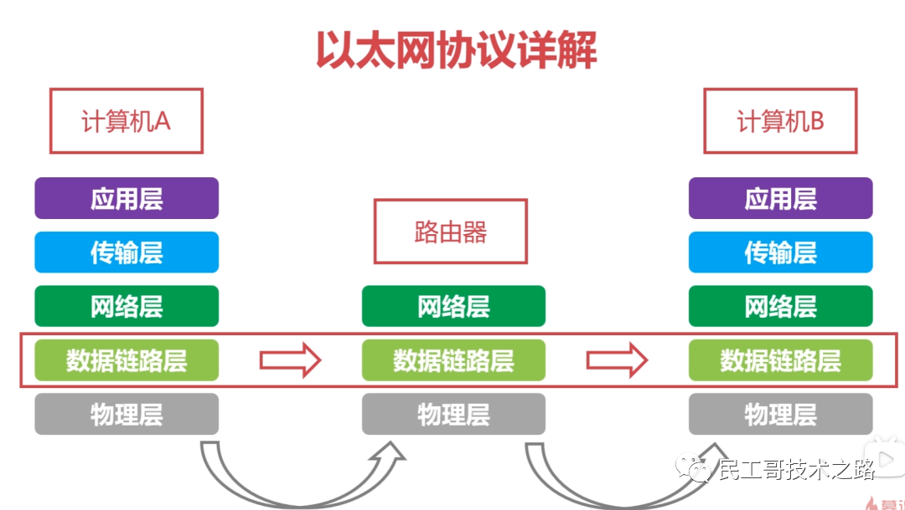

#### 以太网协议详解
MAC地址：每一个设备都拥有唯一的MAC地址，共48位，使用十六进制表示。

以太网协议：是一种使用广泛的局域网技术，是一种应用于数据链路层的协议，使用以太网可以完成相邻设备的数据帧传输：
* 

#### Ethernet以太网IEEE802.3
* 以太网第一个广泛部署的高速局域网；
* 以太网数据速率快；
* 以太网硬件价格便宜，网络造价成本低。

#### 以太网帧结构
* 类型：标识上层协议（2字节）；
* 目的地址和源地址：MAC地址（每个6字节）；
* 数据：封装的上层协议的分组（46~1500字节）；
* CRC：循环冗余码（4字节）；
* 以太网最短帧：以太网帧最短64字节；以太网帧除了数据部分18字节；数据最短46字节。

#### MAC地址（物理地址、局域网地址）
* MAC地址长度为6字节，48位；
* MAC地址具有唯一性，每个网络适配器对应一个MAC地址；
* 通常采用十六进制表示法，每个字节表示一个十六进制数，用 - 或 : 连接起来；
* MAC广播地址：FF-FF-FF-FF-FF-FF。

### 网络层
网络层的目的是实现两个端系统之间的数据透明传送，具体功能包括寻址和路由选择、连接的建立、保持和终止等。数据交换技术是报文交换（基本上被分组所替代）：采用储存转发方式，数据交换单位是报文。

网络层中涉及众多的协议，其中包括最重要的协议，也是TCP/IP的核心协议——IP协议。IP协议非常简单，仅仅提供不可靠、无连接的传送服务。IP协议的主要功能有：无连接数据报传输、数据报路由选择和差错控制。

与IP协议配套使用实现其功能的还有地址解析协议ARP、逆地址解析协议RARP、因特网报文协议ICMP、因特网组管理协议IGMP。

具体的协议我们会在接下来的部分进行总结，有关网络层的重点为：

1. 网络层负责对子网间的数据包进行路由选择。此外，网络层还可以实现拥塞控制、网际互连等功能；
2. 基本数据单位为IP数据报；
3. 包含的主要协议：
    * IP协议（Internet Protocol，因特网互联协议）;
    * ICMP协议（Internet Control Message Protocol，因特网控制报文协议）;
    * ARP协议（Address Resolution Protocol，地址解析协议）;
    * RARP协议（Reverse Address Resolution Protocol，逆地址解析协议）。

#### 路由器及相关协议
* 
* 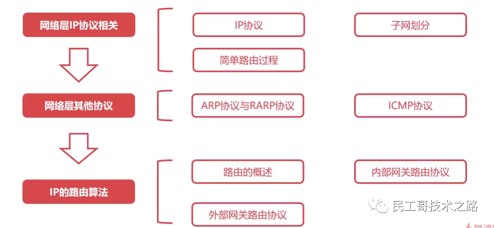

#### IP协议详解
IP网际协议是 Internet 网络层最核心的协议。

虚拟互联网络的产生：实际的计算机网络错综复杂；物理设备通过使用IP协议，屏蔽了物理网络之间的差异；当网络中主机使用IP协议连接时，无需关注网络细节，于是形成了虚拟网络。图片
* 

IP协议使得复杂的实际网络变为一个虚拟互联的网络；并且解决了在虚拟网络中数据报传输路径的问题。
* 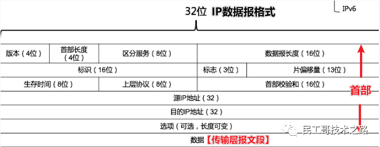
    + 其中，版本指IP协议的版本，占4位，如IPv4和IPv6；
    + 首部位长度表示IP首部长度，占4位，最大数值位15；
    + 总长度表示IP数据报总长度，占16位，最大数值位65535；
    + TTL表示IP数据报文在网络中的寿命，占8位；
    + 协议表明IP数据所携带的具体数据是什么协议的，如TCP、UDP。

#### IP协议的转发流程
* 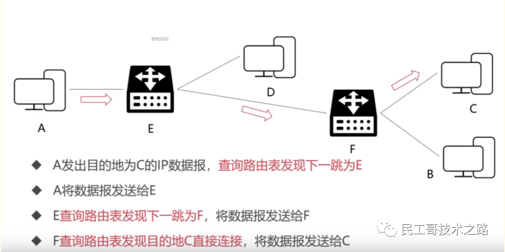

#### IP地址的子网划分
* 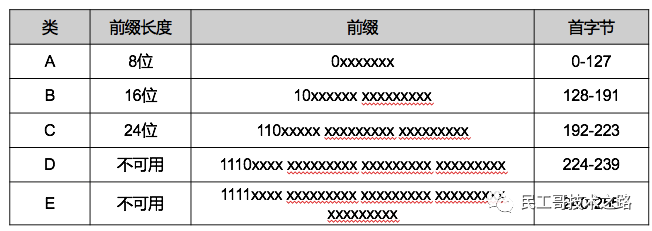
    + A类（8网络号+24主机号）
    + B类（16网络号+16主机号）
    + C类（24网络号+8主机号）可以用于标识网络中的主机或路由器
    + D类地址作为组广播地址
    + E类是地址保留
* 

#### 网络地址转换NAT技术
用于多个主机通过一个公有IP访问访问互联网的私有网络中，减缓了IP地址的消耗，但是增加了网络通信的复杂度。

#### NAT 工作原理
从内网出去的IP数据报，将其IP地址替换为NAT服务器拥有的合法的公共IP地址，并将替换关系记录到NAT转换表中；

从公共互联网返回的IP数据报，依据其目的的IP地址检索NAT转换表，并利用检索到的内部私有IP地址替换目的IP地址，然后将IP数据报转发到内部网络。

#### ARP协议与RARP协议
地址解析协议 ARP（Address Resolution Protocol）：为网卡（网络适配器）的IP地址到对应的硬件地址提供动态映射。可以把网络层32位地址转化为数据链路层MAC48位地址。

ARP 是即插即用的，一个ARP表是自动建立的，不需要系统管理员来配置。
* 

RARP(Reverse Address Resolution Protocol)协议指逆地址解析协议，可以把数据链路层MAC48位地址转化为网络层32位地址。

#### ICMP协议详解
网际控制报文协议（Internet Control Message Protocol），可以报告错误信息或者异常情况，ICMP报文封装在IP数据报当中。
* 

#### ICMP协议的应用
* Ping应用：网络故障的排查；
* Traceroute应用：可以探测IP数据报在网络中走过的路径。

#### 网络层的路由概述
* 关于路由算法的要求：
    + 正确的完整的、在计算上应该尽可能是简单的、可以适应网络中的变化、稳定的公平的。
* 自治系统AS：
    + 指处于一个管理机构下的网络设备群，AS内部网络自治管理，对外提供一个或多个出入口，其中自治系统内部的路由协议为内部网关协议，如RIP、OSPF等；自治系统外部的路由协议为外部网关协议，如BGP。
* 静态路由：
    + 人工配置，难度和复杂度高。
* 动态路由：
    + 链路状态路由选择算法LS：向所有隔壁路由发送信息收敛快；全局式路由选择算法，每个路由器计算路由时，需构建整个网络拓扑图；利用Dijkstra算法求源端到目的端网络的最短路径；Dijkstra(迪杰斯特拉)算法；
    + 距离-向量路由选择算法DV：向所有隔壁路由发送信息收敛慢、会存在回路；基础是Bellman-Ford方程（简称B-F方程）。

#### 内部网关路由协议之RIP协议
路由信息协议 RIP(Routing Information Protocol)【应用层】，基于距离-向量的路由选择算法，较小的AS（自治系统），适合小型网络；RIP报文，封装进UDP数据报。

* RIP协议特性：
    + RIP在度量路径时采用的是跳数（每个路由器维护自身到其他每个路由器的距离记录）；
    + RIP的费用定义在源路由器和目的子网之间；
    + RIP被限制的网络直径不超过15跳；
    + 和隔壁交换所有的信息，30主动一次（广播）。

#### 内部网关路由协议之OSPF协议
开放最短路径优先协议 OSPF(Open Shortest Path First)【网络层】，基于链路状态的路由选择算法（即Dijkstra算法），较大规模的AS ，适合大型网络，直接封装在IP数据报传输。

* OSPF协议优点
    + 安全；
    + 支持多条相同费用路径；
    + 支持区别化费用度量；
    + 支持单播路由和多播路由；
    + 分层路由。

#### RIP与OSPF的对比（路由算法决定其性质）
* 

#### 外部网关路由协议之BGP协议
BGP（Border Gateway Protocol）边际网关协议【应用层】：是运行在AS之间的一种协议,寻找一条好路由：首次交换全部信息，以后只交换变化的部分,BGP封装进TCP报文段。

### 传输层
第一个端到端，即主机到主机的层次。传输层负责将上层数据分段并提供端到端的、可靠的或不可靠的传输。

此外，传输层还要处理端到端的差错控制和流量控制问题。

传输层的任务是根据通信子网的特性，最佳的利用网络资源，为两个端系统的会话层之间，提供建立、维护和取消传输连接的功能，负责端到端的可靠数据传输。

在这一层，信息传送的协议数据单元称为段或报文。

网络层只是根据网络地址将源结点发出的数据包传送到目的结点，而传输层则负责将数据可靠地传送到相应的端口。

#### 有关网络层的重点：
* 传输层负责将上层数据分段并提供端到端的、可靠的或不可靠的传输以及端到端的差错控制和流量控制问题；
* 包含的主要协议：TCP协议（Transmission Control Protocol，传输控制协议）、UDP协议（User Datagram Protocol，用户数据报协议）；
* 重要设备：
    + 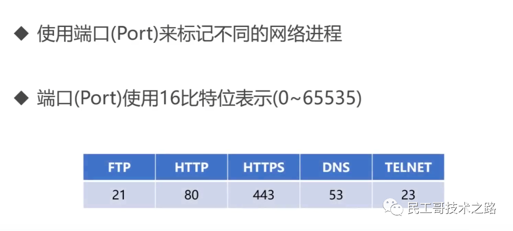
    + 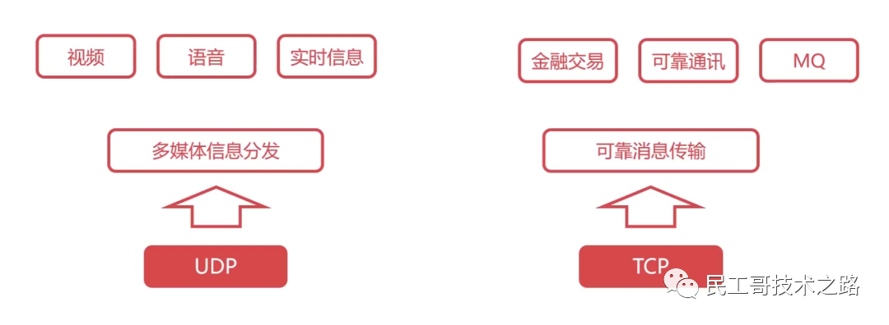

#### UDP协议详解
UDP(User Datagram Protocol: 用户数据报协议)，是一个非常简单的协议。
* 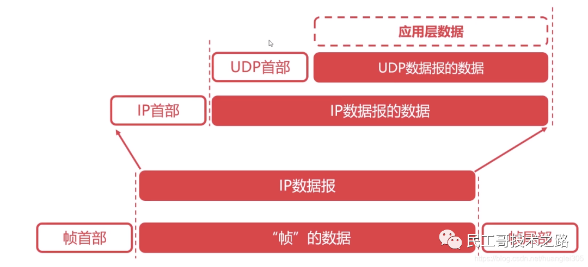

* UDP协议的特点：
    + UDP是无连接协议；
    + UDP不能保证可靠的交付数据；
    + UDP是面向报文传输的；
    + UDP没有拥塞控制；
    + UDP首部开销很小。

* UDP数据报结构：
    + 首部:8B，四字段/2B【源端口 | 目的端口 | UDP长度 | 校验和】 数据字段：应用数据。
    + 

#### TCP协议详解
TCP(Transmission Control Protocol: 传输控制协议)，是计算机网络中非常复杂的一个协议。
* 

##### TCP协议的功能
* 对应用层报文进行分段和重组；
* 面向应用层实现复用与分解；
* 实现端到端的流量控制；
* 拥塞控制；
* 传输层寻址；
* 对收到的报文进行差错检测（首部和数据部分都检错）；
* 实现进程间的端到端可靠数据传输控制。

##### TCP协议的特点
* TCP是面向连接的协议；
* TCP是面向字节流的协议；
* TCP的一个连接有两端，即点对点通信；
* TCP提供可靠的传输服务；
* TCP协议提供全双工通信（每条TCP连接只能一对一）。

##### TCP报文段结构
* 最大报文段长度：报文段中封装的应用层数据的最大长度。
* 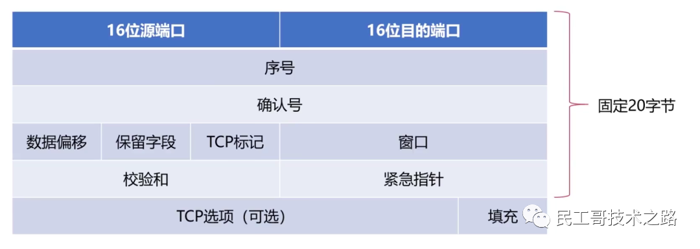

##### TCP首部：
* 序号字段：TCP的序号是对每个应用层数据的每个字节进行编号；
* 确认序号字段：期望从对方接收数据的字节序号，即该序号对应的字节尚未收到。用ack_seq标识；
* TCP段的首部长度最短是20B ，最长为60字节。但是长度必须为4B的整数倍。

##### TCP标记的作用：
* 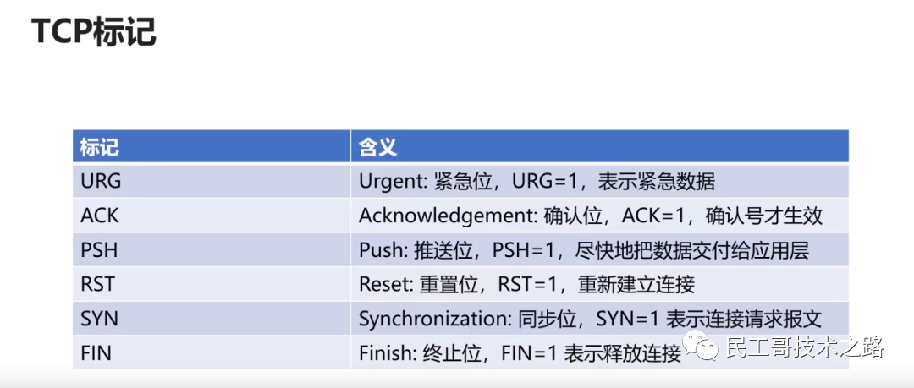

#### 可靠传输的基本原理

##### 基本原理
* 不可靠传输信道在数据传输中可能发生的情况：比特差错、乱序、重传、丢失；
* 基于不可靠信道实现可靠数据传输采取的措施。

差错检测：利用编码实现数据包传输过程中的比特差错检测。

确认：接收方向发送方反馈接收状态。

重传：发送方重新发送接收方没有正确接收的数据。

序号：确保数据按序提交。

计时器：解决数据丢失问题。

停止等待协议：是最简单的可靠传输协议，但是该协议对信道的利用率不高。

连续ARQ(Automatic Repeat reQuest：自动重传请求)协议：滑动窗口+累计确认，大幅提高了信道的利用率。

##### TCP协议的可靠传输
基于连续ARQ协议，在某些情况下，重传的效率并不高，会重复传输部分已经成功接收的字节。

##### TCP协议的流量控制
流量控制：让发送方发送速率不要太快，TCP协议使用滑动窗口实现流量控制。
* 

##### TCP协议的拥塞控制
* 拥塞控制与流量控制的区别：
    + 流量控制考虑点对点的通信量的控制，而拥塞控制考虑整个网络，是全局性的考虑。拥塞控制的方法：慢启动算法+拥塞避免算法。
* 慢开始和拥塞避免：
    + 【慢开始】拥塞窗口从1指数增长；
    + 到达阈值时进入【拥塞避免】，变成+1增长；
    + 【超时】，阈值变为当前cwnd的一半（不能<2）；
    + 再从【慢开始】，拥塞窗口从1指数增长。
    + 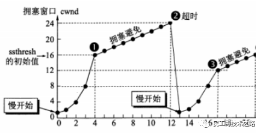
* 快重传和快恢复：
    + 发送方连续收到3个冗余ACK，执行【快重传】，不必等计时器超时；
    + 执行【快恢复】，阈值变为当前cwnd的一半（不能<2），并从此新的ssthresh点进入【拥塞避免】。
    + 

#### TCP连接的三次握手（重要）
##### TCP三次握手使用指令
+ 

面试常客：为什么需要三次握手？
* 第一次握手：客户发送请求，此时服务器知道客户能发；
* 第二次握手：服务器发送确认，此时客户知道服务器能发能收；
* 第三次握手：客户发送确认，此时服务器知道客户能收。

建立连接（三次握手）：
* 第一次：客户向服务器发送连接请求段，建立连接请求控制段（SYN=1），表示传输的报文段的第一个数据字节的序列号是x，此序列号代表整个报文段的序号（seq=x）；客户端进入 SYN_SEND （同步发送状态）；
* 第二次：服务器发回确认报文段，同意建立新连接的确认段（SYN=1），确认序号字段有效（ACK=1），服务器告诉客户端报文段序号是y（seq=y），表示服务器已经收到客户端序号为x的报文段，准备接受客户端序列号为x+1的报文段（ack_seq=x+1）；服务器由LISTEN进入SYN_RCVD （同步收到状态）;
* 第三次：客户对服务器的同一连接进行确认.确认序号字段有效(ACK=1),客户此次的报文段的序列号是x+1(seq=x+1),客户期望接受服务器序列号为y+1的报文段(ack_seq=y+1);当客户发送ack时，客户端进入ESTABLISHED 状态;当服务收到客户发送的ack后，也进入ESTABLISHED状态;第三次握手可携带数据。
* 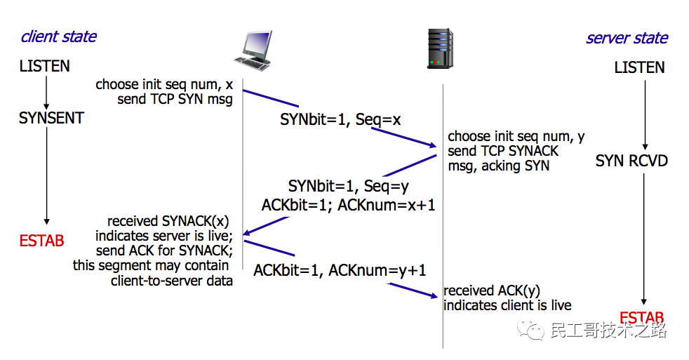

#### TCP连接的四次挥手（重要）
释放连接（四次挥手）
* 第一次：客户向服务器发送释放连接报文段，发送端数据发送完毕，请求释放连接（FIN=1），传输的第一个数据字节的序号是x（seq=x）；客户端状态由ESTABLISHED进入FIN_WAIT_1（终止等待1状态）；
* 第二次：服务器向客户发送确认段，确认字号段有效（ACK=1），服务器传输的数据序号是y（seq=y），服务器期望接收客户数据序号为x+1（ack_seq=x+1）;服务器状态由ESTABLISHED进入CLOSE_WAIT（关闭等待）；客户端收到ACK段后，由FIN_WAIT_1进入FIN_WAIT_2；
* 第三次：服务器向客户发送释放连接报文段，请求释放连接（FIN=1），确认字号段有效（ACK=1），表示服务器期望接收客户数据序号为x+1（ack_seq=x+1）;表示自己传输的第一个字节序号是y+1（seq=y+1）；服务器状态由CLOSE_WAIT 进入 LAST_ACK （最后确认状态）；
* 第四次：客户向服务器发送确认段，确认字号段有效（ACK=1），表示客户传输的数据序号是x+1（seq=x+1），表示客户期望接收服务器数据序号为y+1+1（ack_seq=y+1+1）；客户端状态由FIN_WAIT_2进入TIME_WAIT，等待2MSL时间，进入CLOSED状态；服务器在收到最后一次ACK后，由LAST_ACK进入CLOSED。
* 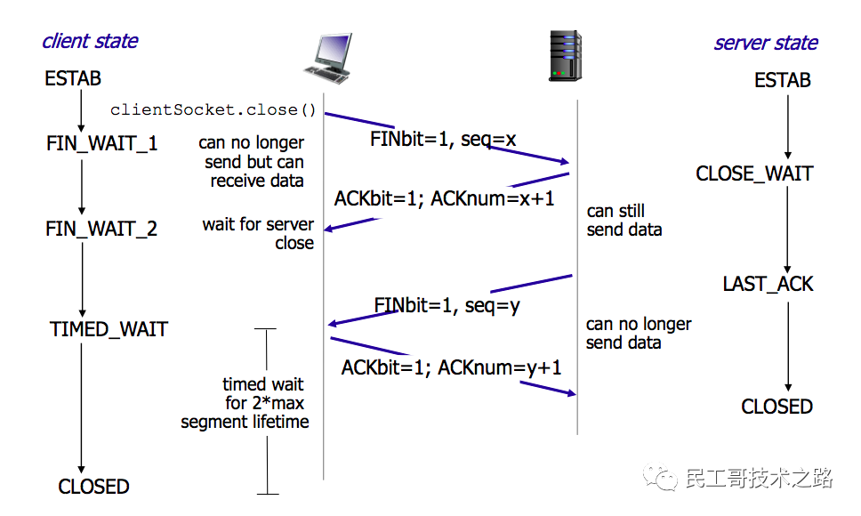
* 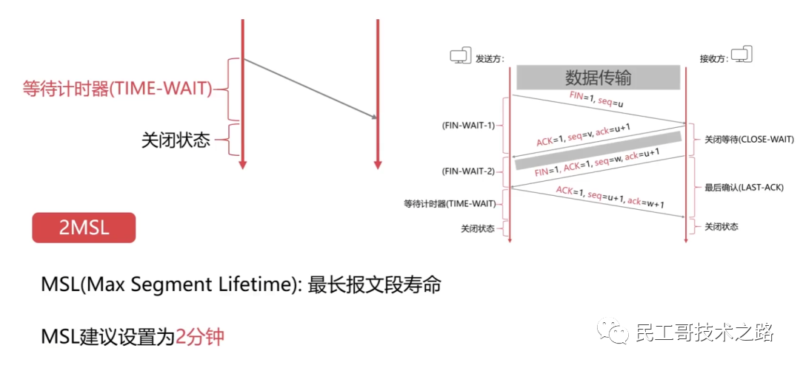

为什么需要等待2MSL?
* 最后一个报文没有确认；
* 确保发送方的ACK可以到达接收方；
* 2MSL时间内没有收到，则接收方会重发；
* 确保当前连接的所有报文都已经过期。

### 应用层
为操作系统或网络应用程序提供访问网络服务的接口。应用层重点：

* 数据传输基本单位为报文；
* 包含的主要协议：FTP（文件传送协议）、Telnet（远程登录协议）、DNS（域名解析协议）、SMTP（邮件传送协议），POP3协议（邮局协议），HTTP协议（Hyper Text Transfer Protocol）。

#### DNS详解
DNS（Domain Name System:域名系统）【C/S，UDP，端口53】：解决IP地址复杂难以记忆的问题,存储并完成自己所管辖范围内主机的 域名 到 IP 地址的映射。

#### 域名解析的顺序
* 浏览器缓存；
* 找本机的hosts文件；
* 路由缓存；
* 找DNS服务器（本地域名、顶级域名、根域名）->迭代解析、递归查询。

IP—>DNS服务—>便于记忆的域名。

域名由点、字母和数字组成，分为顶级域（com，cn，net，gov，org）、二级域（baidu,taobao,qq,alibaba）、三级域（www）(12-2-0852)。
* 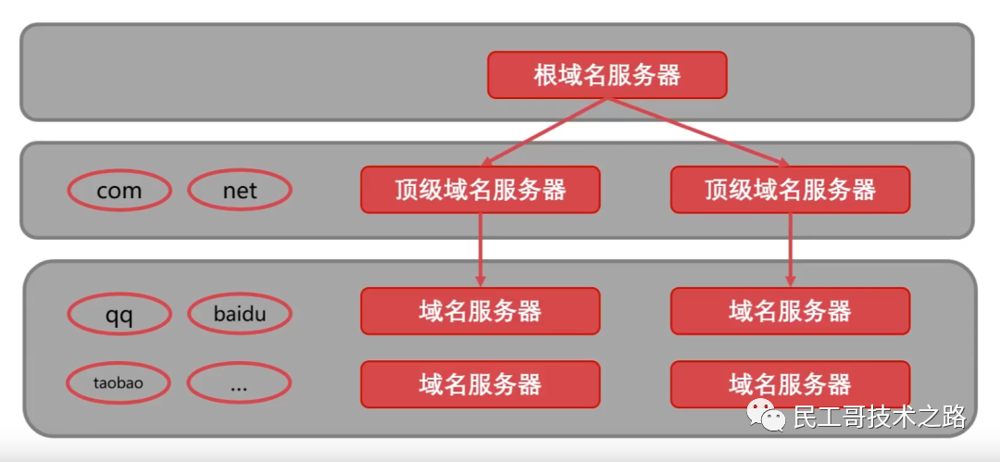

#### DHCP协议详解
DHCP（Dynamic Configuration Protocol:动态主机设置协议）：是一个局域网协议，是应用UDP协议的应用层协议。作用：为临时接入局域网的用户自动分配IP地址。

#### HTTP协议详解
文件传输协议（FTP）：控制连接（端口21）：传输控制信息（连接、传输请求），以7位ASCII码的格式。整个会话期间一直打开。

HTTP（HyperText Transfer Protocol:超文本传输协议）【TCP，端口80】：是可靠的数据传输协议，浏览器向服务器发收报文前，先建立TCP连接，HTTP使用TCP连接方式（HTTP自身无连接）。

#### HTTP请求报文方式
* GET：请求指定的页面信息，并返回实体主体；
* POST：向指定资源提交数据进行处理请求；
* DELETE：请求服务器删除指定的页面；
* HEAD：请求读取URL标识的信息的首部，只返回报文头；
* OPETION：请求一些选项的信息；
* PUT：在指明的URL下存储一个文档。
* 

#### HTTP工作的结构
* 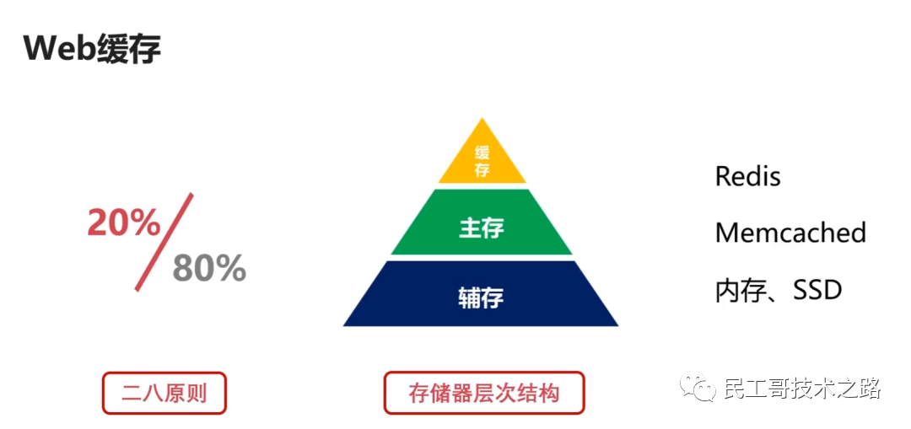

#### HTTPS协议详解
HTTPS(Secure)是安全的HTTP协议，端口号443。基于HTTP协议，通过SSL或TLS提供加密处理数据、验证对方身份以及数据完整性保护。

