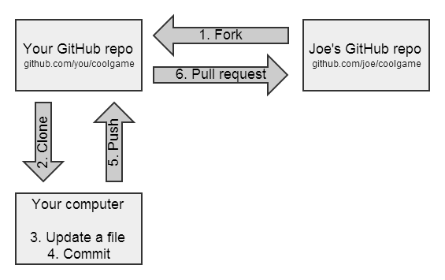

# Fork

## Fork流程图

* 

## Fork a repository
* 案例说明：用户Rose去fork用户Jack的Titanic
  1. 选择需要fork 的repository ，并进入到repository的详情页，根据案例，这里应该Jack/Titanic
  2. 按照图示操作点击 `fork` 按钮
     * 
  3. 核对Owner & Fork from 信息是否正确，这里案例用的用户Rose fork  用户Jack 的 `Jack/Titanic` repository
  4. 修改并确认Respository name ，可以使用Titanic，但建议依据情况增加更具标识性的前缀后缀
  5. 内容填写无误后，点击 `Fork Repository` 进行下一步操作 
     * 
  6. 如图所示，`Rose/Titanic` 仓库已经创建成功，forked from `Jack/Titanic`
     * 

## Syncing a fork
* 案例说明：用户Rose在 [Fork a repository](https://conticat.github.io/#/kubernetes/software/gitea/resources/frok?id=Fork_a_repository)  操作完成后，用户Jack和其余贡献者对`Jack/Titanic`进行了内容修改，用户Rose想要在他们的修改的基础上，还要再做一些修改。在开始之前，最好"同步Rose的fork"，以确保在最新的复制版本里工作。

### web页面

1. 选择需要fork 的repository ，并进入到repository的详情页，根据案例这里应该是`Rose/Titanic`
2. 点击 `New Pull Request` 按钮，进行下一步操作 
   * 
3. ！！！**根据案例，merge into 这里填写的是Rose的仓库和分支**
4. ！！！**根据案例，pull from 这里填写的是Jack的仓库和分支**
   * **第三步和第四步如果反过来，就成了你向原仓库`Jack/Titanic`推送代码了！！！**
     **一定要注意！！！一定要注意！！！一定要注意！！！**
5. 然后可以看下相关代码的分析之后，点击 ` New Pull Request` 进行下一步操作 
   * 
6. 填写的pull request标题信息！！！这里最好是配合第7步进行操作
7. `WIP:` 可以避免意外合并，在第6步信息写好之后，点击 `Start the title with WIP` 按钮进行增加前缀操作！
8. 进行Assignees选择，可以选择自己
9. 信息填写完毕之后，点击[ `Create Pull Request` 按钮进行下一步操作
   *  
10. 核对请求标题是否正确
11. 核对相关变更代码
12. 相关信息都核对完成之后，可以进行删除前缀的操作 点击 ` Remove WIP: prefix` 进行下一步操作
    * 
13. 核对Pull request标题是否正确
14. 点击 `Merge Pull Request` 按钮进行下一步操作
    * 
15. 信息填写完成后，点击 `Merge Pull Request` 按钮进行下一步操作 
    * 
16. From `Jack/titanic`的代码已经合并完成，`Rose/Titanic`已经同步完成
    * 

### git命令

1. 首先将Fork后的仓库clone下来

   * ```shell
     # 克隆远程仓库（根据案例，这里克隆的仓库是Rose/Titanic）
     git clone http://gitea.conti.net/Rose/Titanic.git
     ```

   * 

2. 添加上游仓库（后续操作都在本地仓库目录中执行）

   * ```shell
     # 查看远程信息
     git remote -v
     # 新建远程仓库信息(根据案例,这里的上游仓库是Jack/Titanic)
     git remote add upstream http://gitea.conti.net/Jack/Titanic.git
     ```

   * 

3. 从源仓库同步代码，并合并到本地仓库

    * ```shell
      # 从源代码库更新同步代码
      git fetch upstream
      # 合并到本地仓库
      git merge upstream/master
      ```
      

    * 

4. 更新并合并自己远程仓库的代码，然后将本地合并后的代码push到远程仓库（Rose/Titanic）

    * ```shell
      # 更新自己工作区的代码
      git pull origin master
      #然后将本地仓库合并后的代码push到远程仓库
      git push 
      ```

    * 


## Pull request
* 案例说明：用户Rose在Fork并同步后的仓库基础上，对仓库进行了内容修改，想要将修改信息提交给原仓库用户Jack，这时候Rose就要创建一个Pull request操作，向原仓库作者提交过去“这是我的修改”的请求，当然原作者有权利决定是否采纳Rose的代码。

* web页面（推荐）
  
  * 这里操作步骤与 [Syncing a fork](https://conticat.github.io/#/kubernetes/software/gitea/resources/frok?id=Syncing_a_forkafork) 类似，只是第3步和第4有些许不同 
    
    *  第3步**根据本节案例，merge into 这里填写的是Jack的仓库和分支**
    *  第4步**根据本节案例，pull from 这里填写的是Rose的仓库和分支**
    *  
  
  
